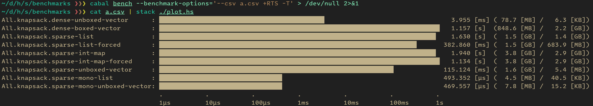

# ベンチマークテスト

## 環境構築

2023 年言語アップデートのスプレッドシートの通りです。

https://docs.google.com/spreadsheets/d/1HXyOXt5bKwhKWXruzUvfMFHQtBxfZQ0047W7VVObnXI/edit#gid=408033513

## [`criterion`] によるベンチマークテストの方法

次のようにベンチマークテストを実行できます:

```sh
$ cabal bench --benchmark-options='--output=$benchmark.html'
```

ベンチマーク結果は `bench.html` に出力されます。以下からご覧頂けます:

https://toyboot4e.github.io/seriously-haskell/

## [`tasty-bench`] によるベンチマークテストの方法

[./benchmarks.cabal](./benchmarks.cabal) を以下の形に編集してください。他のソースは編集不要です:

```sh
benchmark bench
  import:         deps
  type:           exitcode-stdio-1.0
  hs-source-dirs: bench
  main-is:        Main.hs
  cpp-options:    -DATCODER
  build-depends:
    , benchmarks
    , tasty-bench
  mixins:
    tasty-bench (Test.Tasty.Bench as Criterion, Test.Tasty.Bench as Criterion.Main, Test.Tasty.Bench as Gauge, Test.Tasty.Bench as Gauge.Main)
```

### SVG 画像出力

以下のコマンドで SVG 画像出力が得られます:

```sh
$ cabal bench --benchmark-options='--svg a.svg +RTS -T'
```

ただし時間軸を対数スケールにすることはできません:



### ターミナル出力 (対数時間でプロット)

以下のコマンドでベンチマーク結果を保存できます:

```sh
$ # ベンチマークを実行し、結果を `a.csv` に保存する:
$ cabal bench --benchmark-options='--csv a.csv +RTS -T'
```

以下のコマンドでベンチマーク結果を表示できます:

```sh
$ # ベンチマーク結果をプロットする:
$ cat a.csv | stack ./plot.hs
```

```
All.knapsack.dense-unboxed-vector      : ▇▇▇▇▇▇▇▇▇▇▇▇▇▇▇▇▇▇▇▇▇▇▇▇▇▇▇▇▇▇▇▇▇▇▇▇▇▇▇▇▇▇▇                                 3.955 [ms] ( 78.7 [MB] /   6.3 [KB])
All.knapsack.dense-boxed-vector        : ▇▇▇▇▇▇▇▇▇▇▇▇▇▇▇▇▇▇▇▇▇▇▇▇▇▇▇▇▇▇▇▇▇▇▇▇▇▇▇▇▇▇▇▇▇▇▇▇▇▇▇▇▇▇▇▇▇▇▇▇▇▇▇▇▇▇▇▇▇▇▇▇▇   1.147 [s]  (848.6 [MB] /   2.2 [GB])
All.knapsack.sparse-list               : ▇▇▇▇▇▇▇▇▇▇▇▇▇▇▇▇▇▇▇▇▇▇▇▇▇▇▇▇▇▇▇▇▇▇▇▇▇▇▇▇▇▇▇▇▇▇▇▇▇▇▇▇▇▇▇▇▇▇▇▇▇▇▇▇▇▇▇▇▇▇▇▇    1.930 [s]  (  1.5 [GB] /   1.4 [GB])
All.knapsack.sparse-list-forced        : ▇▇▇▇▇▇▇▇▇▇▇▇▇▇▇▇▇▇▇▇▇▇▇▇▇▇▇▇▇▇▇▇▇▇▇▇▇▇▇▇▇▇▇▇▇▇▇▇▇▇▇▇▇▇▇▇▇▇▇▇▇▇▇▇▇▇▇       370.440 [ms] (  1.5 [GB] / 687.7 [MB])
All.knapsack.sparse-int-map            : ▇▇▇▇▇▇▇▇▇▇▇▇▇▇▇▇▇▇▇▇▇▇▇▇▇▇▇▇▇▇▇▇▇▇▇▇▇▇▇▇▇▇▇▇▇▇▇▇▇▇▇▇▇▇▇▇▇▇▇▇▇▇▇▇▇▇▇▇▇▇▇▇▇   1.115 [s]  (  3.8 [GB] /   2.9 [GB])
All.knapsack.sparse-int-map-forced     : ▇▇▇▇▇▇▇▇▇▇▇▇▇▇▇▇▇▇▇▇▇▇▇▇▇▇▇▇▇▇▇▇▇▇▇▇▇▇▇▇▇▇▇▇▇▇▇▇▇▇▇▇▇▇▇▇▇▇▇▇▇▇▇▇▇▇▇▇▇▇▇▇▇   1.149 [s]  (  3.8 [GB] /   2.9 [GB])
All.knapsack.sparse-unboxed-vector     : ▇▇▇▇▇▇▇▇▇▇▇▇▇▇▇▇▇▇▇▇▇▇▇▇▇▇▇▇▇▇▇▇▇▇▇▇▇▇▇▇▇▇▇▇▇▇▇▇▇▇▇▇▇▇▇▇▇▇▇▇▇             114.862 [ms] (  1.6 [GB] /   5.4 [MB])
All.knapsack.sparse-mono-list          : ▇▇▇▇▇▇▇▇▇▇▇▇▇▇▇▇▇▇▇▇▇▇▇▇▇▇▇▇▇▇▇▇                                          493.712 [μs] (  4.5 [MB] /  40.4 [KB])
All.knapsack.sparse-mono-unboxed-vector: ▇▇▇▇▇▇▇▇▇▇▇▇▇▇▇▇▇▇▇▇▇▇▇▇▇▇▇▇▇▇▇▇                                          473.447 [μs] (  7.8 [MB] /  15.4 [KB])
                                         .           .           .           .           .           .           .
                                         1μs         10μs        100μs       1ms         10ms        100ms       1s
```

[`tasty-bench`]: https://github.com/Bodigrim/tasty-bench
[`criterion`]: https://github.com/haskell/criterion


